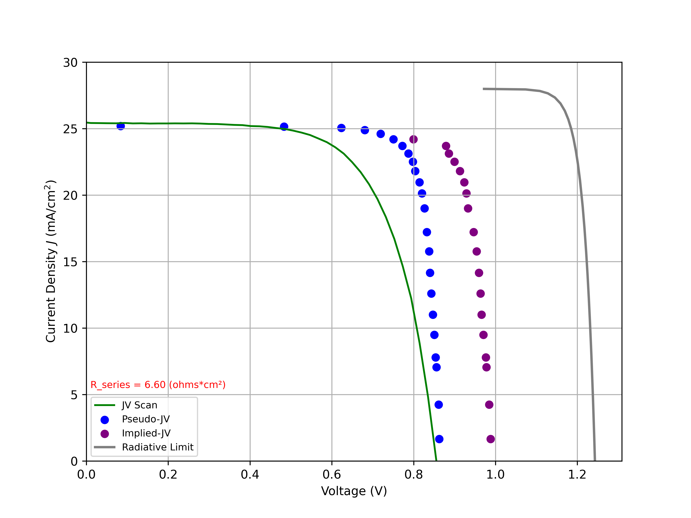

# pseudo-JV
Control and analysis code for pseudo-JV scans in SERF. 
 
Directory pJV_analysis_example contains a notebook for pseudo-JV analysis and necessary demo data files.
 
Demo_figures includes an example of the figures that the notebook outputs.
 

